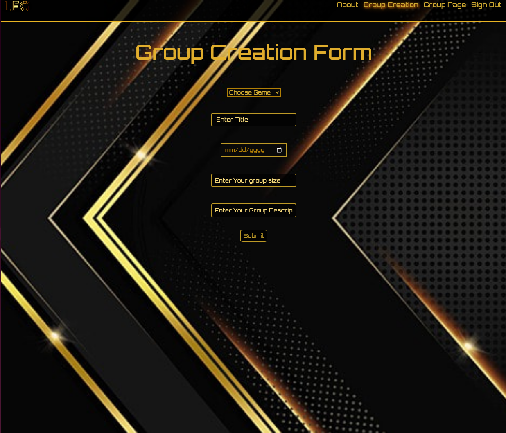
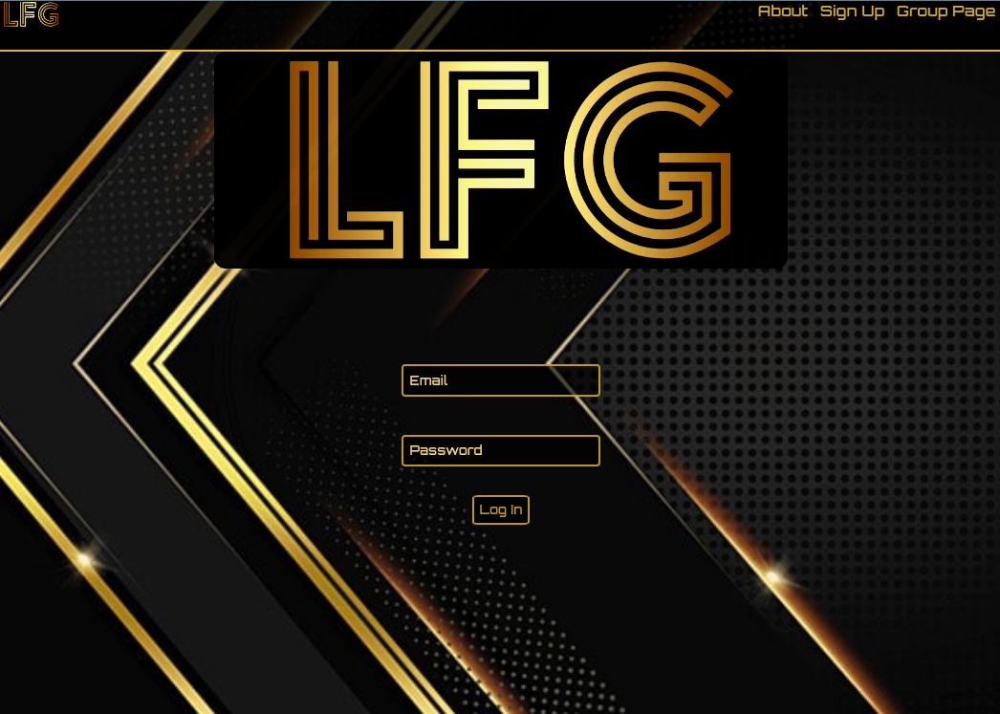
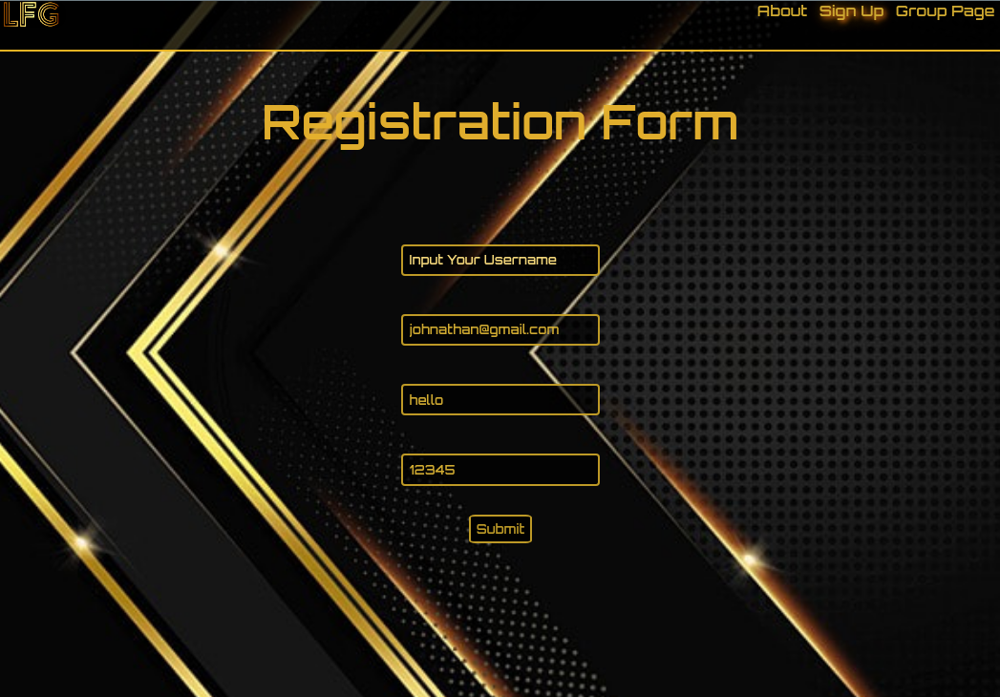
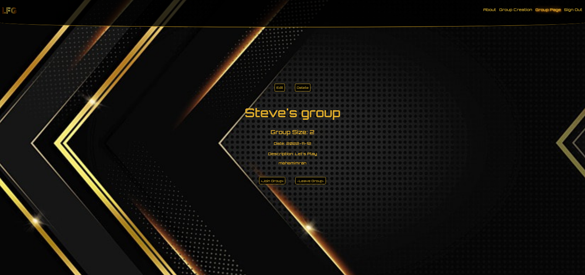
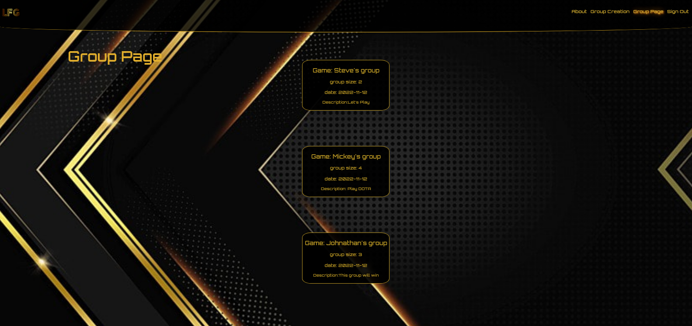

# Group Finder
## [Group Finder](https://github.com/Skim1571/Group-Finder)
## [Group Finder Back End Repo](https://github.com/mahamakhan/Group-Finder-Backend)

## Date: 8/11/2022

### By: 
### Johnathan R Weil [GitHub](https://github.com/JwR513) | [LinkedIn](https://www.linkedin.com/in/johnathan-weil-69b100229/)
### Maham Khan [LinkedIn](https://www.linkedin.com/in/mahamakhan/)  | [Github](https://github.com/mahamakhan)
### Michael Pines[GitHub](https://github.com/smyp1) | [Linkedin](https://www.linkedin.com/in/mickey-pines/) 
### Steve Kim [GitHub](https://github.com/Skim1571) | [LinkedIn](https://www.linkedin.com/in/skim1571/)

---

### **_Description_**

#### Creating a web application where users can create a platform to meet up with other like minded people to play a specific video game of their choosing.
#### The user will be able to do the following: 

- Create an account
- Create a game 
- Find and join a game. 
- Designate a specific time and date for the meet up.  

---

### **_Technologies Used_**

- React
- CSS
- HTML
- Javascript
---

### **_Getting Started_**

#### You will start on the homepage and can register or login. Once you login, you will be able to either find an existing group that's looking for a member to join to play the game with them or you can create a group.

---
### **_Project Management_**

### [ERD](https://app.diagrams.net/#G1wHVE2dl4m9JzqrDlblPFRu4PeO6Tu2RZ)

### [CHD](https://app.diagrams.net/#G1PrY90V_GgitMQ0zOjcT-2ik2PiWB1y2D)

### [Trello](https://trello.com/b/2w0vsJLe/group-finder)

---

### **_Screenshots_**

#### Image 1

#### Image2

#### Image 3

#### Image 4

#### Image 5

---

### **_Future Updates_**

- [ ] 
- [ ] 
- [ ] 

---

### **_Credits_**

---

Footer
© 2022 GitHub, Inc.